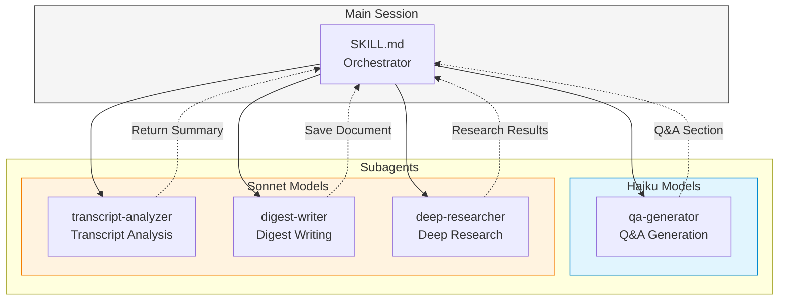

# Video Insight

Analyzes YouTube videos or local media files to generate summaries, insights, and optionally Q&A highlights to reinforce key learning points.

## Architecture



**Context Management**: Main Session handles only orchestration. Long transcript processing is performed by Subagents to protect context.

## Prerequisites

**YouTube URL Processing:**

- Requires `yt-dlp` (`brew install yt-dlp`)

**Local File Processing:**

- Requires `whisper-cpp` (`brew install whisper-cpp`)
- Requires `ffmpeg` (`brew install ffmpeg`)
- Whisper model download (automatic on first run)

Check dependencies: `./scripts/check_dependencies.sh`

## Supported Input Types

| Type | Pattern | Processing Method |
|------|---------|-------------------|
| YouTube URL | `https://youtu.be/...`, `https://youtube.com/...` | Extract subtitles with yt-dlp |
| Video File | `*.mp4`, `*.mov`, `*.mkv`, `*.avi`, `*.webm` | Speech-to-text with whisper.cpp |
| Audio File | `*.mp3`, `*.m4a`, `*.wav`, `*.flac`, `*.aac` | Speech-to-text with whisper.cpp |
| Subtitle File | `*.srt`, `*.vtt` | Use directly |

## Workflow

### Dependency Check (Before Starting)

**CRITICAL**: Check required dependencies before processing. If missing, show installation guide and **stop immediately** (do not retry).

**For YouTube URL:**

```bash
./scripts/check_dependencies.sh --youtube
```

**For Local Media File:**

```bash
./scripts/check_dependencies.sh --local
```

**If exit code is 1 (missing dependencies):**

1. Display the script output (shows missing tools and install commands)
2. Inform user: "Please install the required dependencies and try again."
3. Reference: `references/prerequisites.md` for detailed installation guide
4. **Stop processing** - do not attempt to continue or retry

**Important**: Do not repeatedly check or retry installation. The user must manually install dependencies and re-run the command.

### Step 0: Detect Input Type

Determine if input is YouTube URL or local file:

**YouTube URL Pattern:**

```regex
^https?://(www\.)?(youtube\.com|youtu\.be)
```

**Local File:**

- Check file existence (`[ -f "$INPUT" ]`)
- Determine type by extension

**Branching:**

- YouTube URL → Step 1A (YouTube metadata)
- Local media file → Step 1B (Local metadata)
- Subtitle file (srt/vtt) → Go directly to Step 3
- Invalid input → Error message

### Step 1A: Extract YouTube Metadata

```bash
./scripts/extract_metadata.sh "{youtube_url}"
```

Extract from JSON result:

- `title`, `channel`, `upload_date`, `duration`, `description`
- `chapters` (if available)
- `subtitles`, `automatic_captions` (subtitle availability)

### Step 1B: Extract Local File Metadata

```bash
./scripts/extract_local_metadata.sh "{file_path}"
```

Extract from JSON result:

- `title` (extracted from filename)
- `duration` (extracted with ffprobe)
- `format` (file format)
- `source: "local"` (local file indicator)

### Step 2: Check Video Duration

**If over 60 minutes**, present options with AskUserQuestion:

```yaml
question: "Video duration is {duration}. How would you like to proceed?"
options:
  - label: "Process entire video"
    description: "Process the full video (may take longer)"
  - label: "First 30 minutes only"
    description: "Process only the first 30 minutes"
  - label: "Cancel"
    description: "Cancel video processing"
```

### Step 3: Extract Transcript

**For YouTube URL:**

```bash
./scripts/extract_transcript.sh "{youtube_url}" "/tmp/video-insight"
```

Subtitle priority: Korean manual > English manual > Korean auto > English auto

**If no subtitles available**, present options with AskUserQuestion:

```yaml
question: "No subtitles found. How would you like to proceed?"
options:
  - label: "Summarize description only"
    description: "Create a brief summary from the video description"
  - label: "Cancel"
    description: "Cancel video processing"
```

**For local media file:**

```bash
./scripts/extract_local_transcript.sh "{file_path}" "/tmp/video-insight"
```

Convert speech-to-text with whisper.cpp (Korean default)

**For existing subtitle file:**

Copy srt/vtt file to `/tmp/video-insight/` for use

### Step 4: Analyze Transcript (Subagent)

Call **transcript-analyzer** (Sonnet):

```markdown
Using Task tool:
- subagent_type: "transcript-analyzer"
- model: sonnet
- prompt: |
    Analyze the transcript file.

    - transcript_path: /tmp/video-insight/{title}.ko.srt
    - metadata: {metadata JSON}
    - language: ko

    Extract key content, timeline, and important quotes.
```

**Result**: Return only analysis results to main session (not entire transcript)

### Step 5: Confirm Save Path

Confirm save path with AskUserQuestion:

```yaml
question: "Where would you like to save the digest file?"
header: "Save path"
options:
  - label: "Default path"
    description: "outputs/video/{YYYY-MM-DD}__{title}.md"
  - label: "Current folder"
    description: "./{YYYY-MM-DD}__{title}.md"
  - label: "Custom path"
    description: "Specify a custom path"
```

**If custom path selected**: Request path input from user

### Step 6: Write Digest (Subagent)

Call **digest-writer** (Sonnet):

```markdown
Using Task tool:
- subagent_type: "digest-writer"
- model: sonnet
- prompt: |
    Write a digest document.

    - analysis_result: {Step 4 result}
    - metadata: {metadata}
    - output_path: {path confirmed in Step 5}
    - template_path: templates/video-insight.md

    Also perform proper noun correction and add background information.
```

**Result**: Markdown file saved confirmation message

### Step 7: Additional Content Options

Present options with AskUserQuestion (multiSelect enabled):

```yaml
question: "Would you like to add additional sections?"
header: "Options"
multiSelect: true
options:
  - label: "Q&A Section"
    description: "Add Q&A highlights (1-5 pairs based on content length)"
  - label: "Deep Research"
    description: "Conduct in-depth research with web search"
  - label: "Skip all"
    description: "Generate digest only without additional sections"
```

### Step 8: Generate Additional Content (Parallel Execution)

Based on user selection, execute agents in parallel. Each agent returns content only (does not write to file).

**If Q&A selected**, call **qa-generator** (Haiku):

```markdown
Using Task tool:
- subagent_type: "qa-generator"
- model: haiku
- prompt: |
    Generate Q&A section content.

    - digest_path: {file path from Step 6}
    - qa_patterns_path: references/qa-patterns.md

    Create 1-5 Q&A pairs (based on content length) highlighting key information from the video.
    Return the Q&A section content in markdown format (do not write to file).
```

**If Deep Research selected**, call **deep-researcher** (Sonnet):

```markdown
Using Task tool:
- subagent_type: "deep-researcher"
- model: sonnet
- prompt: |
    Perform deep research.

    - digest_path: {file path from Step 6}
    - deep_research_reference: references/deep-research.md

    Collect related materials via web search.
    Return the Deep Research section content in markdown format (do not write to file).
```

**Parallel Execution**: If both options are selected, launch both Task tools in a single message for parallel execution.

### Step 9: Append Results to Digest

After agents complete, append returned content to the digest file:

1. Read current digest content
2. Append Q&A section (if generated)
3. Append Deep Research section (if generated)
4. Write updated content to digest file

### Step 10: Cleanup Temporary Files

After all tasks complete, confirm cleanup with AskUserQuestion:

```yaml
question: "Would you like to clean up temporary subtitle files?"
header: "Cleanup"
options:
  - label: "Clean up"
    description: "Delete subtitle files in /tmp/video-insight/ folder"
  - label: "Keep"
    description: "Keep subtitle files for additional work"
```

**If clean up selected:**

```bash
rm -rf /tmp/video-insight/
```

Display message: "Temporary files have been cleaned up."

**If keep selected:**

Display file location:

```text
Temporary subtitle files are kept at /tmp/video-insight/
Manual cleanup: rm -rf /tmp/video-insight/
```

## Bundled Resources

| Path | Description |
|------|-------------|
| `scripts/check_dependencies.sh` | Check whisper-cpp, ffmpeg installation and download model |
| `scripts/extract_metadata.sh` | Extract YouTube metadata JSON with yt-dlp |
| `scripts/extract_local_metadata.sh` | Extract local file metadata JSON with ffprobe |
| `scripts/extract_transcript.sh` | Extract YouTube subtitles with yt-dlp (srt format) |
| `scripts/extract_local_transcript.sh` | Convert local file speech-to-text with whisper.cpp |
| `templates/video-insight.md` | Output document template |
| `references/prerequisites.md` | macOS/Ubuntu installation guide for yt-dlp, whisper-cpp, ffmpeg |
| `references/qa-patterns.md` | 3-level Q&A pattern guide |
| `references/deep-research.md` | Deep Research workflow |

## Subagents

| Agent | Model | Role |
|-------|-------|------|
| `transcript-analyzer` | Sonnet | Read/analyze transcript (context saving) |
| `digest-writer` | Sonnet | Write digest + web search |
| `qa-generator` | Haiku | Generate Q&A section |
| `deep-researcher` | Sonnet | Deep research + web search |

## Error Handling

| Situation | Action |
|-----------|--------|
| yt-dlp not installed | Installation guide (`brew install yt-dlp`) |
| whisper-cpp not installed | Installation guide (`brew install whisper-cpp`) |
| ffmpeg not installed | Installation guide (`brew install ffmpeg`) |
| Whisper model missing | Run `check_dependencies.sh` to download |
| Invalid URL | Error message + correct format guide |
| File not found | File path verification guide |
| Unsupported format | Supported format list guide |
| No subtitles (YouTube) | Present fallback options |
| 60+ minute media | Present processing options |
| Subagent failure | Display error message + retry option |

## Context Management

**Handled in Main Session:**

- Metadata extraction (small JSON)
- User option selection
- Subagent orchestration
- Final result summary display

**Handled in Subagent:**

- Read/analyze long transcript (transcript-analyzer)
- Write detailed document (digest-writer)
- Generate Q&A section (qa-generator)
- Web search/deep research (deep-researcher)

## Design Rationale

**Multi-Agent Architecture**: Reading long transcripts directly in main session quickly exhausts context. Processing in Subagents and returning only results protects main context.

**Model Selection**:

- Haiku: Simple/repetitive tasks (Q&A generation)
- Sonnet: Analysis/creative tasks (transcript analysis, digest writing, deep research)

**Optional Q&A**: Not all users want Q&A sections. Providing it as optional increases flexibility.

**Separate Deep Research**: Additional web search is an optional feature, incurring cost only when needed.
